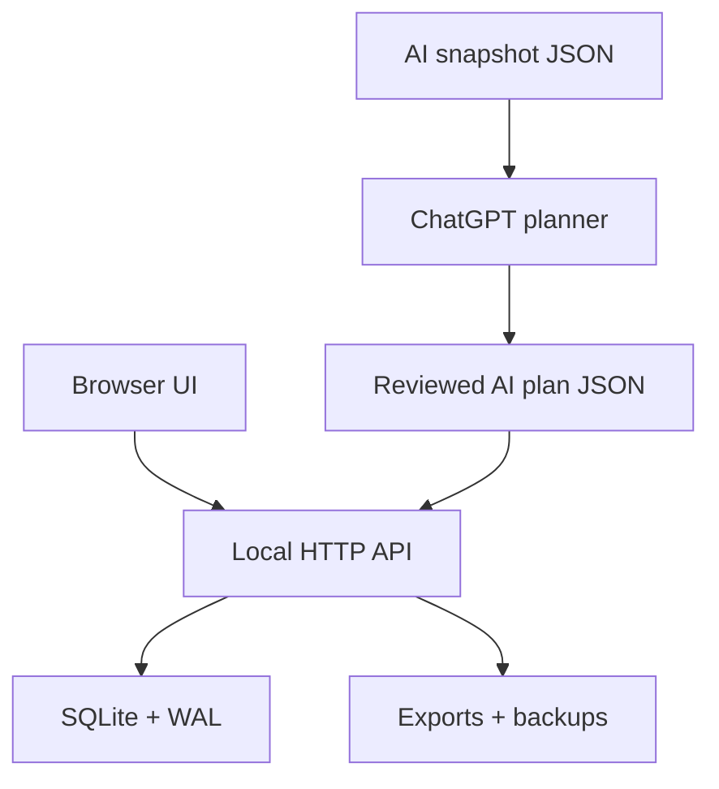

# FORGE Architecture

## Components

- `forge_app.py`: schema migration, timer/domain logic, summaries, AI protocol, HTTP handlers and server startup. This monolith is the canonical runtime but a known maintainability weakness.
- `static/index.html`: semantic shell and dialogs.
- `static/app.js`: API client, state and rendering/interactions.
- `static/styles.css` + `static/layout.css`: visual system and 0.9.1 corrective responsive layout. The two-layer arrangement should be consolidated after GUI stability.
- SQLite tables: missions, timer sessions, manual adjustments, projects, milestones, notes, import ledger, planning decisions and study reviews.
- PowerShell scripts: install/upgrade rollback, start/single-instance behavior and backup.

## Data flow and trust boundaries

The server binds to `127.0.0.1` and searches ports 8877–8896, avoiding conflicts with JOLT/VERIDRA. The browser sends JSON to the local API. User data stays in the installation directory. AI exchange is explicit file export/import; imported changes are previewed, tied to the latest export and ledgered.

External AI output is untrusted input. Validation bounds text/numbers, restricts actions/fields, verifies IDs, rejects stale plans and backs up before application. Static/download path resolution is constrained to known directories.

## Persistence and recovery

SQLite uses WAL, foreign keys and a busy timeout. A heartbeat limits elapsed time after accidental closure. Backups use SQLite's backup API and integrity checks. Installer upgrades preserve `data`, `exports` and `backups`, verify the new version and contain rollback logic.

## Source and release control

The installed computer owns mutable personal data. The Git working tree owns reproducible code and project-control documents. The public GitHub remote is the off-device source mirror and CI runner; it must never be used to synchronise the SQLite database or AI exports. `tools/build_release.py` selects an explicit application allowlist and rejects private data before creating a ZIP.

## Weaknesses

- Runtime, schema and HTTP layer share one large Python file.
- Frontend is one dense JavaScript file with no build/module system.
- No authenticated network boundary beyond loopback binding.
- UI E2E and Windows installer behavior lack current executed evidence.
- Legacy tomorrow/rollover backend remains although normal planning moved to ChatGPT.
